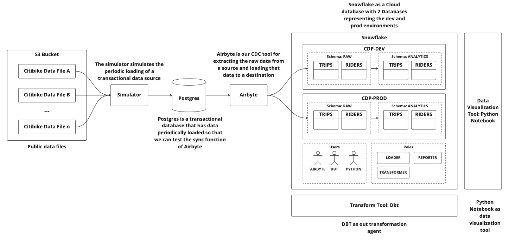

# Cloud Data Platform

As enterprises adopt Cloud-native data warehouses, like Snowflake and BigQuery, complimentary tools and techniques are needed to develop data pipelines, establish sound data governance, and produce analytics at scale and reliably for their organizations.

This project was set up to demonstrate how we can use modern software engineering practices and tools to supplement a set of modern, open-source data tech stack to build and scale our Cloud-native data warehouse.

> **Notes**
> 
> **This project is still a work-in-progress**, there's still work left for dbt transformation.

## Architecture

### Data Warehouse

While the goal of this project is to use open-source tools as much as possible, the de-facto data warehouse that most enterprises use today is Snowflake. So Snowflake is used our data warehouse for this project. We may add Druid as a sample data warehouse in later versions of this project.

### ELT

ETL, which stands for Extract, Transform, Load, is a technique that integrates data from one data source into a data warehouse. ETL was developed in the 1970's when compute and storage resources were scare - hence transform the datasets first and then load what is needed to the target data system. Because transformation is performed before data loading, data engineers would need to rebuild and rerun the entire pipeline.

With the advent of the cloud, we are no longer constrained by compute/storage resources and costs. In recent years, ELT, which stands for Extract, Load, Transform, emerged as a viable alternative to ETL for integrating data into a data warehouse from various data sources. We will be using ELT in this project.

## Tools

The following tools are used in this project:

| Component                       | Tool                                                                                | Version |
|---------------------------------|-------------------------------------------------------------------------------------|---------|
| Data warehouse                  | [Snowflake ](https://snowflake.com)                                                 | n/a     |
| Data extractor (EL)             | [Airbyte](https://github.com/airbytehq/airbyte)                                     | 0.43    |
| Transformaton tool (T)          | [Data Builder Tool (DBT)](https://github.com/dbt-labs/dbt-core)                     | 1.4     |
| Data unit test framework/runner | [Great Expectations (GX)](https://github.com/great-expectations/great_expectations) | 0.15    |
| Environment provisioning        | [Terraform](https://github.com/hashicorp/terraform)                                 | 1.3     |
| Python (dbt prerequisite)       | [Python](https://www.python.org/)                                                   | 3.7     |

## Setup

1. Set up the needed resources eg. databases, warehouses, users, and roles on Snowflake using Terraform. Read [Snowflake provisioning using Terraform](snowflake) for details.
2. Build the project for running a "simulated" transactional data source, from which Airbyte will extract. Read [Running the data source simulator](simulator) for details.

## References

* [DBT Labs Recommended Snowflake Setup](https://www.getdbt.com/blog/how-we-configure-snowflake/)
