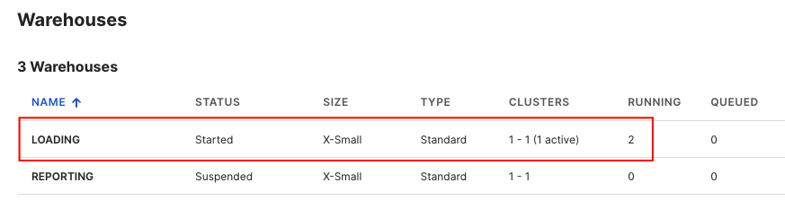

# Airbyte

## Setup

We are using Airbyte default setup method by running the bash script [run-ab-platform.sh](run-ab-platform.sh). The script will download and use the latest docker compose manifest and config files from Airbyte's Github page to run Airbyte and its dependencies as containers. Make sure you have the local engine running with sufficient CPU and memory resources allocated - 2 CPU cores and 2 GB memory should be minimal.

1. Run the script to start Airbyte.

   ```shell
   ./run-ab-platform.sh
   ```

1. Launch a web browser and navigate to <http://localhost:8000> and log in with the following credentials.
   * **Username**: airbyte
   * **Password**: password

   You can also change the admin username and password by changing the following configs in `.env`.

   * `BASIC_AUTH_USERNAME=airbyte`
   * `BASIC_AUTH_PASSWORD=password`

1. Once you are in the console, create your first connection.

   

1. For the Source, enter the parameters for our Postgres database. Note: **port number** is 5433.

   

1. For the Destination, enter the parameters for our Snowflake database.

   

   Snowflake connection URL can be constructed from one of the following ways:

   * Preferred: <org-name>-<account-name>.snowflakecomputing.com
   * Legacy: <snowflake-account-locator>.<region>.<cloud-provider>.snowflakecomputing.com

   From your Snowflake console, go to **Admin** > **Accounts** to get the pertinent info you need to construct the connection URL.

   

1. For the Connection configuration, we can pretty much leave the settings as they are (for our first run). Although try changing the frequency of sync by using cron expression.

   

1. Once you are done setting the Connection, Airbyte will extract and load the data into Snowflake. You will notice that the Warehouse `LOADING` on Snowflake will start and perform the loading process.

   

## References

* [Airbyte: Snowflake Setup](https://docs.airbyte.com/integrations/destinations/snowflake/)
