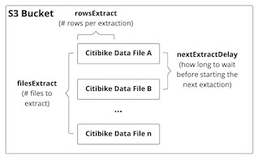

# Simulator

Build the project for running a "simulated" transactional data source, from which Airbyte will extract.

## Overview



Snowflake offers a beginner's workshop called [Virtual Zero-to-Snowflake](https://s3.amazonaws.com/snowflake-workshop-lab/OnlineZTS_LabGuide.pdf) hands-on lab. The lab uses the sample data from Citibike, which the data from the past 7 years or so are made available on a public AWS S3 bucket. We can load all the data from the S3 bucket directly into Snowflake with just 1 load using a Snowflake feature called **Stage**.

However, one of the goals of this project is to play around with Airbyte and try out its change data capture capability. So we want to be able to do the following:

* Instead of loading all available transactional data from S3 all at once, we want to simulate the "citibike" application database (running on postges) where transactions would be stored.
* A Go program called simulator is written to simulate a series of incremental batch insertions of (trip and rider) transactions from S3 to the posgres database. The frequency of inserts can be adjusted in the [config.yaml](config.yaml) file.
* Airbyte can be configured to extract any data that are added to postgres since last sync before loading the data to Snowflake.  

## Setup

1. Open a shell and start Postgres by running:

   ```shell
   make docker-up
   ```

1. Build and run the simulator:

   ```shell
   make build
   bin/simulator start
   ```

1. When we are done, run the following to teardown and close out the resources:

   ```shell
   make docker-down
   ```
